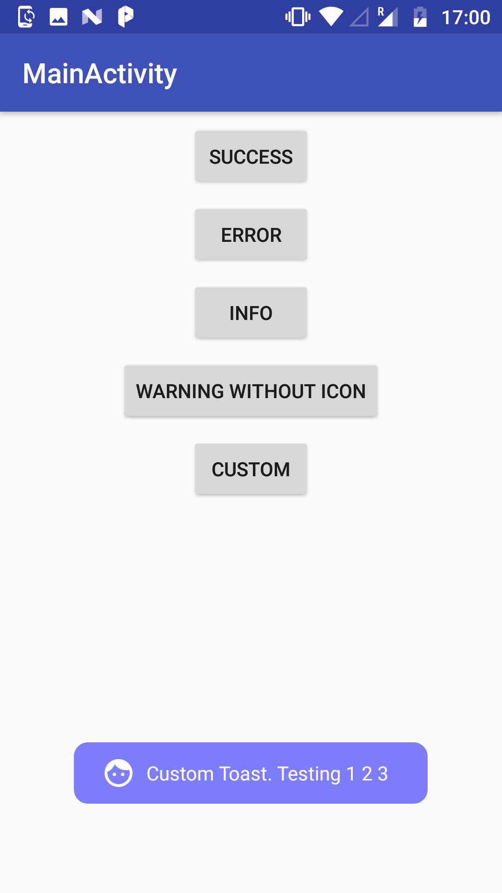
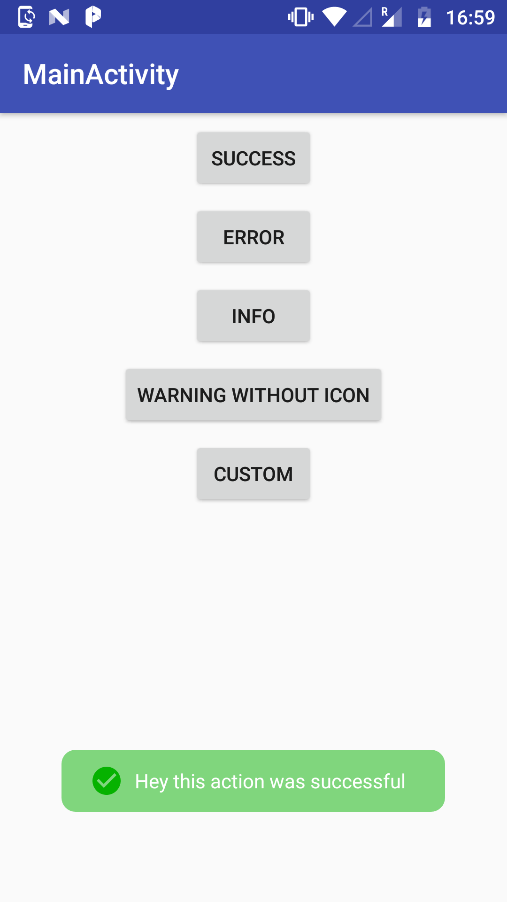
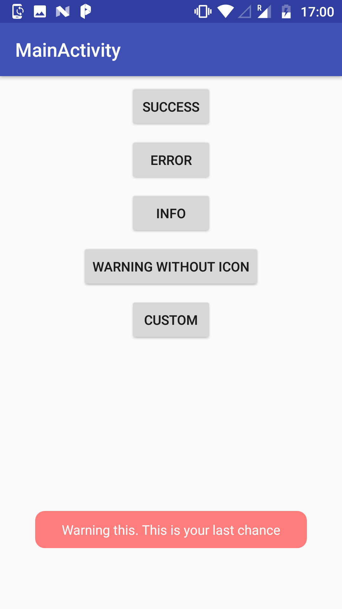
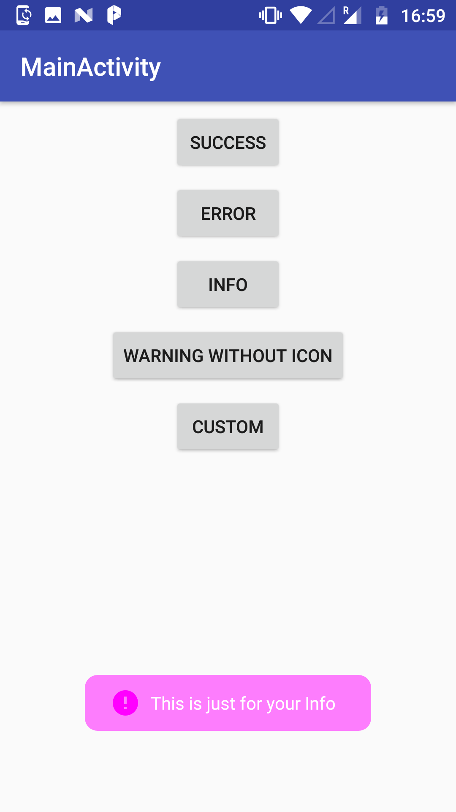
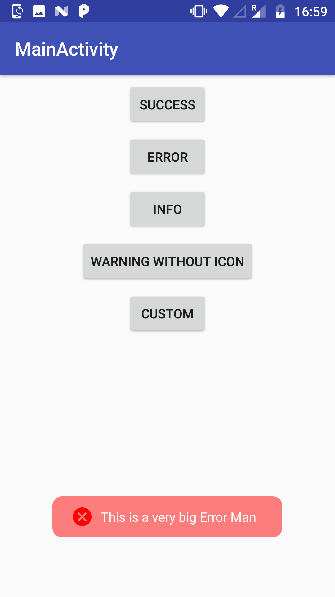

## Toasts

Toast your regular android **Toasts**. 
Toasts is a simple android library written with :heart: in **Kotlin** to provide predefined and customizable toasts with styling and icon options. **Toasts** besides being customizable are as simple to use as Logs.

## Screenshots

                                            

## Usage

Default Toasts
#Success Toasts

    Toasts.s(this,getString(R.string.success_string),Toast.LENGTH_LONG).show()

#Warning Toast

    Toasts.w(this,getString(R.string.warning_string),Toast.LENGTH_LONG).show()

    
  #Error Toasts

    Toasts.e(this, getString(R.string.error_string),Toast.LENGTH_LONG).show()

  #Info Toasts   

    Toasts.i(this,getString(R.string.info_string),Toast.LENGTH_LONG).show()

 #Custom Toasts

    Toasts.c(this,getString(R.string.custom_string),Toast.LENGTH_LONG,icon,backgroundColor = Color.BLUE).show()

For all type of toasts,

 - Context 
 - Text 
 - Duration are compulsory, all other parameters will be provided as per default if not supplied

Remaining parameters
|Parameter  |Default Value  |Compulsory  |
|--|--|--|
|Icon|Each interpreation has its own drawable|No|
|Text Color |Color.WHITE 	 |No|
|Background Color|Each interpreation has its own color|No|
|TintIcon  | false	 |No|

You can also define your toasts in following way if you want to set it up in your own order of arguments

 

//You can use in any order if variable = value method
//You can define any of the attributes, remaining which you dont want to change would be taken up default

            Toasts.c(
                    textColor = Color.BLUE,
                    icon = icon,
                    backgroundColor = Color.GREEN,
                    context = this,
                    duration = 1,
                    text = "well"
            ).show()

## Are custom options only available for Toasts.c?

 No, all the variations can be applied to success, info, warning and error in a similar way.
 
## Can I change the Theme?

Success isn't Green for everyone. Yes you can change the default values at any point of time

#Say

        Toasts.set(textColor = Color.BLACK,
                   errorColor = Color.BLUE)

#Any of these can be set , in any order, at any point of time

      Toasts.set(
    	 textColor =TEXT_COLOR,
    	 defaultColor = COLOR,
    	 successColor= SUCCESS_COLOR, 
    	 errorColor = ERROR_COLOR,
         infoColor=INFO_COLOR, 
         warningColor= WARNING_COLOR)

## Can I do variations with the Toasts?
Yes, each method always returns an Android Toast object. So you can use this Toast object in whichever form you want. Dont forget to ***show*** Toasts.

## ToDo

 - [ ] Gravity Customizations
 - [ ]  Improvements
 - [ ]  Explore Download Url from Web and supply it to Toasts
 - [ ]  Explore Gradient backgrounds

## Contributions

This is my first project in Kotlin. This library was primarily developed to understand the functioning of Kotlin and library development. Will really appreciate all the contribution and feedbacks for the same.

## License
MIT License

Copyright (c) 2018 Bhavita Lalwani

Permission is hereby granted, free of charge, to any person obtaining a copy
of this software and associated documentation files (the "Software"), to deal
in the Software without restriction, including without limitation the rights
to use, copy, modify, merge, publish, distribute, sublicense, and/or sell
copies of the Software, and to permit persons to whom the Software is
furnished to do so, subject to the following conditions:

The above copyright notice and this permission notice shall be included in all
copies or substantial portions of the Software.

THE SOFTWARE IS PROVIDED "AS IS", WITHOUT WARRANTY OF ANY KIND, EXPRESS OR
IMPLIED, INCLUDING BUT NOT LIMITED TO THE WARRANTIES OF MERCHANTABILITY,
FITNESS FOR A PARTICULAR PURPOSE AND NONINFRINGEMENT. IN NO EVENT SHALL THE
AUTHORS OR COPYRIGHT HOLDERS BE LIABLE FOR ANY CLAIM, DAMAGES OR OTHER
LIABILITY, WHETHER IN AN ACTION OF CONTRACT, TORT OR OTHERWISE, ARISING FROM,
OUT OF OR IN CONNECTION WITH THE SOFTWARE OR THE USE OR OTHER DEALINGS IN THE
SOFTWARE.
