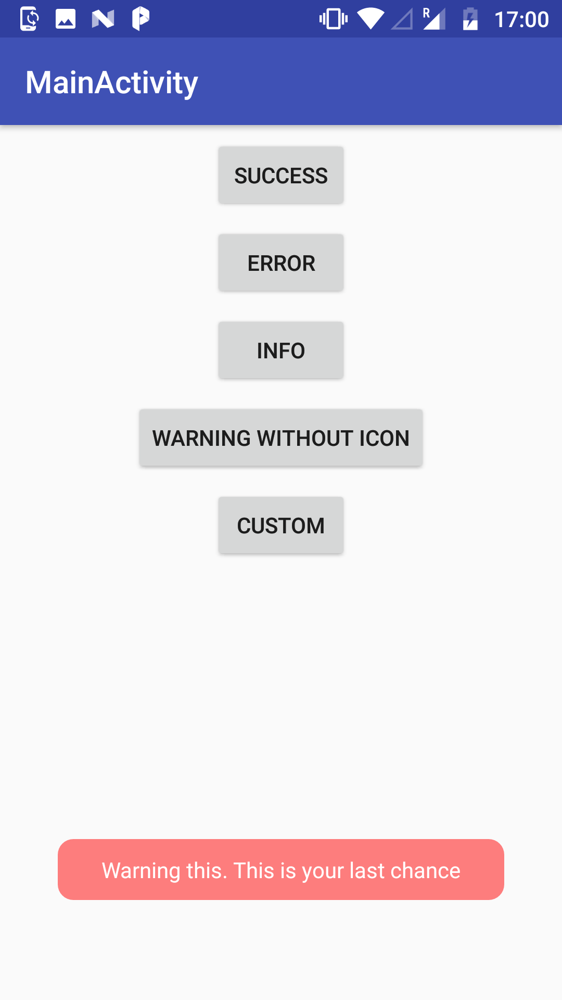

---

---

<h2 id="toasts">Toasts</h2>

Toast your regular android <strong>Toasts</strong>. 
Toasts is a simple android library written with ❤️ in <strong>Kotlin</strong> to provide predefined and customizable toasts with styling and icon options. <strong>Toasts</strong> besides being customizable are as simple to use as Logs.

<h2 id="screenshots">Screenshots</h2>

                

                

<h2 id="usage">Usage</h2>

Default Toasts 
#Success Toasts

<pre><code>Toasts.s(this,getString(R.string.success_string),Toast.LENGTH_LONG).show()
</code></pre>

#Warning Toast

<pre><code>Toasts.w(this,getString(R.string.warning_string),Toast.LENGTH_LONG).show()
</code></pre>

#Error Toasts

<pre><code>Toasts.e(this, getString(R.string.error_string),Toast.LENGTH_LONG).show()
</code></pre>

#Info Toasts

<pre><code>Toasts.i(this,getString(R.string.info_string),Toast.LENGTH_LONG).show()
</code></pre>

#Custom Toasts

<pre><code>Toasts.c(this,getString(R.string.custom_string),Toast.LENGTH_LONG,icon,backgroundColor = Color.BLUE).show()
</code></pre>

For all type of toasts,

<ul>
<li>Context</li>
<li>Text</li>
<li>Duration are compulsory, all other parameters will be provided as per default if not supplied</li>
</ul>

Remaining parameters

<table>
<thead>
<tr>
<th>Parameter</th>
<th>Default Value</th>
<th>Compulsory</th>
</tr>
</thead>
<tbody>
<tr>
<td>Icon</td>
<td>Each interpreation has its own drawable</td>
<td>No</td>
</tr>
<tr>
<td>Text Color</td>
<td>Color.WHITE</td>
<td>No</td>
</tr>
<tr>
<td>Background Color</td>
<td>Each interpreation has its own color</td>
<td>No</td>
</tr>
<tr>
<td>TintIcon</td>
<td>false</td>
<td>No</td>
</tr>
</tbody>
</table>
You can also define your toasts in following way if you want to set it up in your own order of arguments

//You can use in any order if variable = value method 
//You can define any of the attributes, remaining which you dont want to change would be taken up default

<pre><code>        Toasts.c(
                textColor = Color.BLUE,
                icon = icon,
                backgroundColor = Color.GREEN,
                context = this,
                duration = 1,
                text = "well"
        ).show()
</code></pre>
<h2 id="are-custom-options-only-available-for-toasts.c">Are custom options only available for Toasts.c?</h2>

No, all the variations can be applied to success, info, warning and error in a similar way.

<h2 id="can-i-change-the-theme">Can I change the Theme?</h2>

Success isn’t Green for everyone. Yes you can change the default values at any point of time

#Say

<pre><code>    Toasts.set(textColor = Color.BLACK,
               errorColor = Color.BLUE)
</code></pre>

#Any of these can be set , in any order, at any point of time

<pre><code>  Toasts.set(
	 textColor =TEXT_COLOR,
	 defaultColor = COLOR,
	 successColor= SUCCESS_COLOR, 
	 errorColor = ERROR_COLOR,
     infoColor=INFO_COLOR, 
     warningColor= WARNING_COLOR)
</code></pre>
<h2 id="can-i-do-variations-with-the-toasts">Can I do variations with the Toasts?</h2>

Yes, each method always returns an Android Toast object. So you can use this Toast object in whichever form you want. Dont forget to <em><strong>show</strong></em> Toasts.

<h2 id="todo">ToDo</h2>
<ul>
<li class="task-list-item"><input type="checkbox" class="task-list-item-checkbox" disabled=""> Gravity Customizations</li>
<li class="task-list-item"><input type="checkbox" class="task-list-item-checkbox" disabled="">  Improvements</li>
<li class="task-list-item"><input type="checkbox" class="task-list-item-checkbox" disabled="">  Explore Download Url from Web and supply it to Toasts</li>
<li class="task-list-item"><input type="checkbox" class="task-list-item-checkbox" disabled="">  Explore Gradient backgrounds</li>
</ul>
<h2 id="contributions">Contributions</h2>

This is my first project in Kotlin. This library was primarily developed to understand the functioning of Kotlin and library development. Will really appreciate all the contribution and feedbacks for the same.

<h2 id="license">License</h2>

MIT License

Copyright © 2018 Bhavita Lalwani

Permission is hereby granted, free of charge, to any person obtaining a copy 
of this software and associated documentation files (the “Software”), to deal 
in the Software without restriction, including without limitation the rights 
to use, copy, modify, merge, publish, distribute, sublicense, and/or sell 
copies of the Software, and to permit persons to whom the Software is 
furnished to do so, subject to the following conditions:

The above copyright notice and this permission notice shall be included in all 
copies or substantial portions of the Software.

THE SOFTWARE IS PROVIDED “AS IS”, WITHOUT WARRANTY OF ANY KIND, EXPRESS OR 
IMPLIED, INCLUDING BUT NOT LIMITED TO THE WARRANTIES OF MERCHANTABILITY, 
FITNESS FOR A PARTICULAR PURPOSE AND NONINFRINGEMENT. IN NO EVENT SHALL THE 
AUTHORS OR COPYRIGHT HOLDERS BE LIABLE FOR ANY CLAIM, DAMAGES OR OTHER 
LIABILITY, WHETHER IN AN ACTION OF CONTRACT, TORT OR OTHERWISE, ARISING FROM, 
OUT OF OR IN CONNECTION WITH THE SOFTWARE OR THE USE OR OTHER DEALINGS IN THE 
SOFTWARE.

